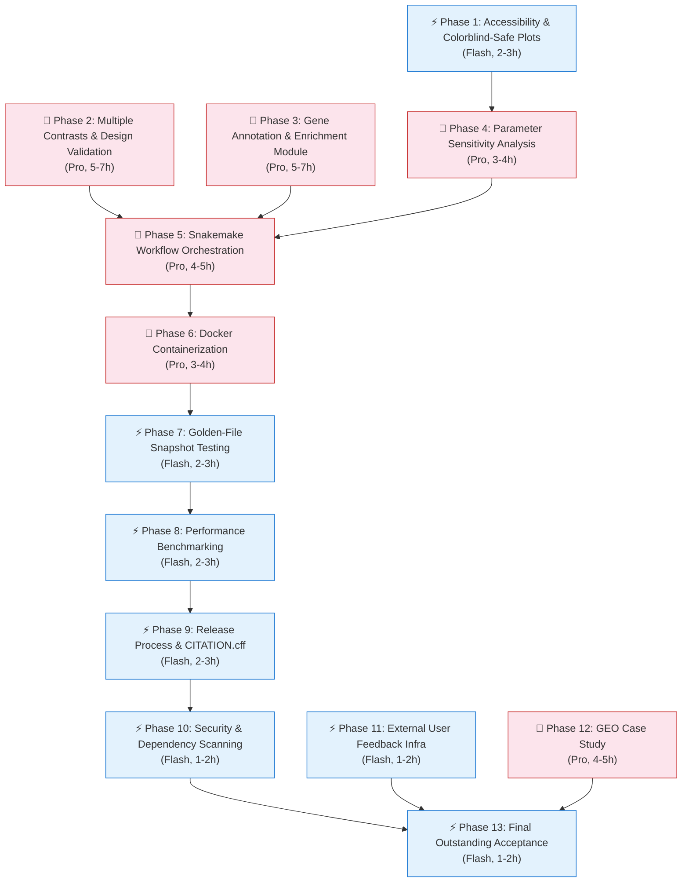

# Outstanding Version — Implementation Plan

> **Status**: Approved and ready for implementation
> **Last updated**: 2026-09-29
> **Implementing agents**: Gemini 3.1 Pro High (🧠 Pro phases) and Gemini 3.8 Flash High (⚡ Flash phases)

## Current State Assessment

The Good Portfolio version is **fully complete**. All 8 acceptance criteria are checked off in the roadmap. The project has:

- ✅ 39 passing tests, lint clean, mypy configured
- ✅ 3 datasets (Airway, Pasilla, Bottomly) with provenance
- ✅ CI with lint + mypy + tests + smoke test
- ✅ 7 plot types, reproducibility manifest, filtering transparency
- ✅ Enhanced HTML report with methodology, provenance, limitations, reproducibility
- ✅ README with input spec, output spec, methodology, limitations, citations
- ✅ Community files (CODE_OF_CONDUCT, CONTRIBUTING, issue templates)
- ✅ Dataset-specific limitations, walkthrough doc

---

## Resolved Design Decisions

These decisions were made during plan review and apply to all phases:

| Question | Decision | Rationale |
|---|---|---|
| Snakemake dependency | **Optional** — not a runtime dependency; users install separately if wanted | Keeps the core package lightweight; most users only need the CLI |
| Gene annotation data source | **Local bundled CSV** with scripts for easy re-retrieval | Reproducibility over freshness; scripts allow updating |
| GEO case study | **Included** in Outstanding release | Demonstrates real-world public-data hygiene |
| Docker base image | **`python:3.12-slim`** (standard) | Better compatibility with scientific Python packages |
| External feedback | **Prepare infrastructure**, leave manual solicitation as TODO | Feedback template and issue template ready; human does the outreach |

---

## Gap Analysis: Good Portfolio → Outstanding

The Outstanding version requires 13 capabilities and 7 acceptance criteria from `docs/ROADMAP.md`.

| # | Roadmap Requirement | Status | Notes |
|---|---|---|---|
| 1 | Containerized execution (Docker) + non-container route | ❌ | No Dockerfile exists |
| 2 | Workflow orchestration (Snakemake or internal runner) | ❌ | Pipeline is a single CLI call, no DAG |
| 3 | Multiple planned contrasts + design-matrix validation | ❌ | Only single contrast supported |
| 4 | Optional gene annotation + pathway/enrichment module | ❌ | No annotation layer exists |
| 5 | Report sections: provenance, QC, model spec, results, parameter sensitivity, limitations, rerun | 🟡 | All except parameter sensitivity present |
| 6 | Parameter-sensitivity comparison (≥1 threshold variation) | ❌ | Not implemented |
| 7 | Golden-file / snapshot testing | ❌ | No snapshot tests |
| 8 | Performance benchmark on synthetic inputs | ❌ | No benchmarks |
| 9 | Release process: semver, changelog, release notes, archived output, CITATION.cff | ❌ | Version exists but no changelog/release process |
| 10 | Security review: dependency scanning, secret scan in CI | 🟡 | Forbidden-file check exists; no dependency/secret scanning |
| 11 | Accessibility review: colorblind-safe palette, readable labels | 🟡 | Some palette choices; no systematic review |
| 12 | External feedback from biology-aware user | ❌ | Not yet solicited |
| 13 | All Good portfolio requirements maintained | ✅ | Verified |

### Acceptance Criteria Gaps

| # | Criterion | Status |
|---|---|---|
| A | Clean container run recreates documented demo report | ❌ |
| B | Reproducibility metadata sufficient for exact identification | 🟡 (manifest exists, no release tag) |
| C | Workflow failure points have helpful messages + tested recovery | ❌ |
| D | Benchmark and quality results visible in repository | ❌ |
| E | At least one external user has followed quickstart + feedback | ❌ |
| F | Tagged release installable via release documentation | ❌ |
| G | Every README claim stays within exploratory, non-clinical scope | ✅ |

---

## Phase Dependency Graph



---

## Agent Execution Guide

Each phase is a self-contained task spec. One phase = one feature branch = one PR.

| Model | Use When |
|---|---|
| **🧠 Pro** | Multi-file architectural changes, new modules with complex logic, statistical code, template systems, workflow/container design |
| **⚡ Flash** | Well-scoped single-file edits, config/YAML fixes, community file creation, documentation-only changes, CI config, simple test additions |

**Before every phase**: Read `AGENTS.md` and `.agent/WORKFLOW.md`. Run `uv run pytest && uv run ruff check . && uv run mypy src/` after every phase. Do not bundle phases.

---

## Phase 1: Accessibility & Colorblind-Safe Plots

**Branch:** `feat/accessibility-plots`
**Model:** ⚡ Flash
**Effort:** ~2–3 hours

### What to do

1. **Modify** `src/rnax/pipeline/plots.py`:
   - Replace the current hard-coded palette `{"Up": "#e41a1c", "Down": "#377eb8", "Not Significant": "#999999"}` in `plot_volcano` and `plot_ma` with a **colorblind-safe** palette. Use the Wong (2011) palette widely recommended in scientific publishing:
     - Up: `"#D55E00"` (vermillion)
     - Down: `"#0072B2"` (blue)
     - Not Significant: `"#999999"` (gray, fine for CBF)
   - Extract palette into a module-level `CB_PALETTE` constant so all plots share it.
   - Add `fontsize` parameters to all axis labels and titles (minimum 12pt for labels, 14pt for titles).
   - Add point-shape differentiation to volcano/MA/PCA plots as a secondary distinguishing channel alongside color.
   - Ensure all plots use `plt.rcParams` overrides for `axes.labelsize`, `axes.titlesize`, and `legend.fontsize` within a context manager to avoid side effects.
   - Add `alt` text strings to all plot functions (return them for inclusion in the HTML `alt` attribute).

2. **Modify** `src/rnax/templates/report.html.j2`:
   - Add meaningful `alt` text to all `` tags (currently generic like "Library Sizes Plot").
   - Ensure text contrast meets WCAG AA (the `.alert` and `.observation` divs already look fine, but verify).
   - Add a `<meta name="description">` tag for accessibility.

3. **Update tests** in `tests/test_plots.py`:
   - Verify the colorblind-safe palette constant is used in the volcano/MA plots.

### Acceptance criteria
- [ ] Volcano, MA, and PCA plots use colorblind-safe colors
- [ ] All plot labels are ≥12pt, titles ≥14pt
- [ ] HTML report images have descriptive `alt` text
- [ ] All 39+ existing tests pass

### Decision log
Add D-8: Adopt Wong (2011) colorblind-safe palette as the standard plot color scheme.

---

## Phase 2: Multiple Contrasts & Design-Matrix Validation

**Branch:** `feat/multiple-contrasts`
**Model:** 🧠 Pro (significant architecture change to config, CLI, and pipeline)
**Effort:** ~5–7 hours

### What to do

1. **Modify** `src/rnax/config.py`:
   - Add a `contrasts` field to `AnalysisConfig` as an *optional list* of contrast specifications:
     ```python
     class ContrastSpec(BaseModel):
         name: str  # e.g. "dex_vs_untreated"
         condition_column: str
         reference_level: str
         comparison_level: str
     ```
   - When `contrasts` is omitted, fall back to the existing single-contrast behavior from `design`.
   - Add a `validate_design_matrix()` method on `AnalysisConfig` that:
     - Checks that each contrast references a valid column and levels present in metadata.
     - Detects perfect confounding between condition and blocking covariate.
     - Warns if any group has < 3 replicates.

2. **Modify** `src/rnax/cli.py`:
   - When `contrasts` is provided, loop over each contrast, running `run_deseq2` per contrast.
   - Generate separate output subdirectories per contrast (e.g., `results/airway/dex_vs_untreated/`).
   - Generate a combined summary index page listing all contrasts.

3. **Modify** `src/rnax/pipeline/deseq.py`:
   - Accept contrast specification as a parameter (rather than reading from `config.design` directly).
   - Preserve the single-contrast code path.

4. **Modify** `src/rnax/pipeline/report.py`:
   - Support per-contrast report generation.
   - Generate a top-level index if multiple contrasts are present.

5. **Create** `config/airway_multi.yaml`:
   - Example config with multiple contrasts on Airway data (if the data supports it — Airway has only two conditions, so demonstrate with a second config that creates subsets, or document why a single dataset might only have one meaningful contrast and show the multi-contrast feature with a synthetic or Bottomly+strain example).

6. **Create** `tests/test_design_validation.py`:
   - Test confounding detection.
   - Test replicate-count warnings.
   - Test that invalid contrast levels fail with clear errors.
   - Test backward compatibility: existing single-contrast configs still work.

### Acceptance criteria
- [ ] Existing single-contrast configs work unchanged (backward compatible)
- [ ] A config with `contrasts: [...]` generates per-contrast reports
- [ ] Design validation detects confounding and missing levels
- [ ] At least 6 new tests for design validation and multi-contrast behavior
- [ ] All tests pass, lint clean, mypy clean

### Decision log
Add D-9: Support multiple planned contrasts via optional `contrasts` config field; single-contrast design remains the default.

---

## Phase 3: Gene Annotation & Pathway/Enrichment Module

**Branch:** `feat/gene-annotation-enrichment`
**Model:** 🧠 Pro (new module with clear separation of annotation from statistical results)
**Effort:** ~5–7 hours

> **Key design decision**: Annotation data is **bundled locally as CSV** for reproducibility. Scripts are provided in `scripts/` for re-retrieving updated annotation databases when needed. The module does NOT make network calls at runtime.

### What to do

1. **Add dependency**: `gseapy>=1.0` to `pyproject.toml` for gene-set enrichment analysis.

2. **Create** `src/rnax/pipeline/annotation.py`:
   - `load_gene_annotations(gene_ids: list[str], organism: str, annotation_dir: Path) -> pd.DataFrame`:
     - Load gene symbols and descriptions from a local bundled CSV in `data/annotations/`.
     - Supported organisms: `"human"`, `"mouse"`, `"drosophila"`.
     - Return a DataFrame with `gene_id`, `gene_symbol`, `description`.
     - If organism is unknown or file is missing, return an empty DataFrame and log a warning.
   - `run_enrichment(results_df: pd.DataFrame, gene_sets_path: Path, organism: str, fdr_thresh: float) -> pd.DataFrame | None`:
     - Extract significant gene IDs (by padj < threshold).
     - Run over-representation analysis (ORA) using `gseapy.enrich` against a local gene-set file.
     - Return enrichment results or `None` if insufficient genes or unsupported organism.
     - Add prominent caveat: "Enrichment results are derived from database annotations and statistical tests on gene lists. They do not constitute biological validation."

3. **Create** `scripts/fetch_annotations.py`:
   - Script to download/update annotation CSVs from Ensembl BioMart or NCBI gene_info.
   - Saves to `data/annotations/human_genes.csv`, `data/annotations/mouse_genes.csv`, `data/annotations/drosophila_genes.csv`.
   - Prints SHA-256 checksums.
   - **This script requires network access; it is NOT called at runtime.**

4. **Create** `data/annotations/` directory:
   - Bundle small gene-annotation CSVs (gene_id → symbol → description) for the three supported organisms.
   - Create `data/annotations/PROVENANCE.md` documenting source, version, retrieval date.

5. **Modify** `src/rnax/config.py`:
   - Add optional `annotation` section:
     ```python
     class AnnotationConfig(BaseModel):
         enabled: bool = False
         organism: str = "human"  # "human", "mouse", "drosophila"
         gene_sets: str = "GO_Biological_Process_2023"
         enrichment_fdr: float = Field(default=0.05, ge=0.0, le=1.0)
     ```

6. **Modify** `src/rnax/pipeline/report.py` and `src/rnax/templates/report.html.j2`:
   - If annotation is enabled, add "Gene Annotations" section showing top genes with symbols/descriptions.
   - If enrichment ran, add "Pathway Enrichment (Exploratory)" section with results table and explicit caveat box.
   - Visually separate annotation/enrichment from the core DE results with a clear header.

7. **Modify** results output:
   - Save `annotated_results.csv` with gene symbols joined to DE results.
   - Save `enrichment_results.csv` if enrichment ran.

8. **Create** `tests/test_annotation.py`:
   - Test annotation loading with mock data.
   - Test enrichment with mock gene sets.
   - Test graceful degradation when annotation is disabled.
   - Test caveat text appears in report.

### Acceptance criteria
- [ ] Annotation is **off by default** (existing configs unaffected)
- [ ] No network calls at runtime — all annotation data is local
- [ ] `scripts/fetch_annotations.py` exists for updating annotation databases
- [ ] When enabled, results CSV includes gene symbols alongside statistical columns
- [ ] Enrichment results are clearly labeled "Exploratory" and include caveats
- [ ] Report visually separates annotations from statistical results
- [ ] Graceful fallback when organism is unsupported
- [ ] At least 5 new tests
- [ ] All tests pass, lint clean, mypy clean

### Decision log
Add D-10: Add optional gene annotation and pathway enrichment module; disabled by default, uses locally bundled annotation CSVs (no runtime network calls), clearly separated from statistical results, with mandatory exploratory-only caveats.

---

## Phase 4: Parameter Sensitivity Analysis

**Branch:** `feat/parameter-sensitivity`
**Model:** 🧠 Pro (statistical analysis, comparison logic, new report section)
**Effort:** ~3–4 hours

### What to do

1. **Create** `src/rnax/pipeline/sensitivity.py`:
   - `run_sensitivity_analysis(results_df, config) -> SensitivityResult`:
     - Vary FDR thresholds on the *same* base results: default (e.g., 0.05) vs. relaxed (0.10) vs. stringent (0.01).
     - Vary fold-change thresholds: default (1.0) vs. relaxed (0.5) vs. stringent (1.5).
     - For each parameter set, count: total genes tested, significant up, significant down.
     - Return a structured result comparing hit counts across settings.
   - `SensitivityResult` dataclass containing:
     - A comparison table (list of dicts or DataFrame).
     - A stability verdict:
       - "Stable" if the same top genes appear across FDR settings.
       - "Sensitive" if results change substantially (>50% difference in hit count).
   - This should **not** re-run the full expensive DESeq2 pipeline — it only varies the thresholds applied to the *existing* results DataFrame.

2. **Modify** `src/rnax/cli.py`:
   - After main analysis, run sensitivity analysis.
   - Add `--sensitivity / --no-sensitivity` CLI flag (default: enabled).

3. **Modify** `src/rnax/pipeline/report.py` and `src/rnax/templates/report.html.j2`:
   - Add "Parameter Sensitivity" section showing the comparison table.
   - Report whether high-level conclusions (direction and approximate scale of DE) are stable.

4. **Create** `tests/test_sensitivity.py`:
   - Test with mock results DataFrame.
   - Test stability verdict logic.
   - Test that varying FDR threshold changes hit counts predictably.

### Acceptance criteria
- [ ] Sensitivity comparison table appears in the report
- [ ] Both FDR and fold-change threshold variations are demonstrated
- [ ] Stability verdict is stated explicitly ("Stable" or "Sensitive")
- [ ] No additional expensive computation; reuses existing DESeq2 results
- [ ] At least 4 new tests
- [ ] All tests pass, lint clean, mypy clean

### Decision log
Add D-11: Add parameter-sensitivity comparison as a report section, varying FDR and fold-change thresholds on existing results.

---

## Phase 5: Snakemake Workflow Orchestration

**Branch:** `feat/snakemake-workflow`
**Model:** 🧠 Pro (workflow DAG design, Snakemake rules, failure recovery)
**Effort:** ~4–5 hours

> **Key design decision**: Snakemake is an **optional** dependency. Users who want workflow orchestration install it separately (`pip install snakemake`). The direct CLI (`rnax analyze`) remains the primary interface and does NOT require Snakemake.

### What to do

1. **Document** Snakemake as an optional dependency in `pyproject.toml` (add to `[project.optional-dependencies]`):
   ```toml
   [project.optional-dependencies]
   workflow = ["snakemake>=8.0"]
   ```

2. **Create** `workflow/Snakefile`:
   - Define rules for each pipeline stage:
     - `rule validate`: run validation on inputs
     - `rule deseq2`: run differential expression
     - `rule plots`: generate all plots
     - `rule report`: render HTML report
     - `rule sensitivity`: run parameter sensitivity (optional)
     - `rule annotate`: run annotation/enrichment (optional, if enabled in config)
     - `rule all`: default target producing the final report
   - Use config file path as a parameter: `snakemake --configfile config/pasilla.yaml`
   - Implement proper input/output file tracking for each rule.

3. **Create** `workflow/README.md`:
   - Document how to install Snakemake (`uv pip install snakemake` or `pip install rnax[workflow]`).
   - Document how to run via Snakemake vs. direct CLI.
   - Explain the DAG and what each rule does.
   - Document failure recovery: what to do if a step fails.

4. **Add tested recovery guidance**:
   - Each rule should have clear error messages when prerequisites are missing.
   - Document: "If rule X fails, check Y, fix Z, then rerun."

5. **Create** `tests/test_workflow.py`:
   - Test that the Snakefile parses without errors (if Snakemake is installed).
   - Test dry-run (`snakemake -n`) on Pasilla config.
   - Test that failure in one rule produces an actionable message.
   - Use `pytest.importorskip("snakemake")` to skip tests when Snakemake is not installed.

### Acceptance criteria
- [ ] `snakemake --configfile config/pasilla.yaml` runs the full pipeline (when installed)
- [ ] DAG has proper input/output tracking
- [ ] Workflow failure points have helpful messages
- [ ] Direct CLI (`rnax analyze`) still works without Snakemake installed
- [ ] Snakemake is optional — core `uv sync` does not install it
- [ ] At least 3 new tests (skipped gracefully when Snakemake not installed)
- [ ] Documentation in `workflow/README.md`

### Decision log
Add D-12: Adopt Snakemake as the optional workflow orchestration layer; direct CLI remains the primary interface. Snakemake is installable via `rnax[workflow]` optional dependency group.

---

## Phase 6: Docker Containerization

**Branch:** `feat/docker`
**Model:** 🧠 Pro (Dockerfile, multi-stage build, CI integration)
**Effort:** ~3–4 hours

### What to do

1. **Create** `Dockerfile`:
   - Multi-stage build:
     - Stage 1 (`builder`): Install `uv`, sync dependencies.
     - Stage 2 (`runtime`): Copy installed environment, copy source code.
   - Base image: `python:3.12-slim`.
   - Set working directory, copy `uv.lock`, `pyproject.toml`, `src/`, `config/`, `data/`, `workflow/`.
   - Default entrypoint: `rnax analyze`.
   - Ensure `git` is available in the container for the manifest's git-commit detection (or handle gracefully when absent).

2. **Create** `docker-compose.yml`:
   - Service for running analysis with volume-mounted config and output directories.
   - Example:
     ```yaml
     services:
       rnax:
         build: .
         volumes:
           - ./config:/app/config
           - ./data:/app/data
           - ./results:/app/results
         command: ["rnax", "analyze", "--config", "config/pasilla.yaml"]
     ```

3. **Create** `.dockerignore`:
   - Exclude `.git`, `.venv`, `results/`, `.mypy_cache`, `.ruff_cache`, `.pytest_cache`, `__pycache__`.

4. **Update** `README.md`:
   - Add "Container Execution" section documenting both Docker and non-container routes.

5. **Update** `.github/workflows/ci.yml`:
   - Add a `docker-test` job that builds the image and runs the Pasilla smoke test inside the container.

6. **Test locally**:
   - `docker build -t rnax .`
   - `docker run --rm -v $(pwd)/results:/app/results rnax rnax analyze --config config/pasilla.yaml`
   - Verify `results/pasilla/report.html` is generated.

### Acceptance criteria
- [ ] `docker build -t rnax .` succeeds
- [ ] Container run produces the same report structure as native
- [ ] Non-container route (`uv run rnax analyze`) still documented and works
- [ ] CI builds and tests the Docker image
- [ ] `.dockerignore` prevents bloat
- [ ] README documents both execution paths

### Decision log
Add D-13: Containerize with Docker using `python:3.12-slim` multi-stage build; non-container route remains fully supported.

---

## Phase 7: Golden-File / Snapshot Testing

**Branch:** `feat/snapshot-testing`
**Model:** ⚡ Flash (well-scoped test additions using deterministic fixtures)
**Effort:** ~2–3 hours

### What to do

1. **Add dependency**: `pytest-snapshot` or implement a simple custom comparator in dev dependencies.

2. **Create** `tests/snapshots/` directory:
   - Store expected output schemas and report fragments.

3. **Create** `tests/test_snapshots.py`:
   - Run the Pasilla pipeline on fixture data with a fixed seed.
   - Compare `results.csv` column names and shape against a golden file.
   - Compare `report.html` structure (presence of required sections) against a golden file.
   - Compare normalized counts shape against expectations.
   - Use deterministic fixtures (Pasilla data + fixed random seed = deterministic output).

4. **Create golden files**:
   - `tests/snapshots/pasilla_results_schema.json`: expected column names and dtypes.
   - `tests/snapshots/pasilla_report_sections.txt`: list of required HTML section headings.

5. **Document** in `tests/README.md` how to update snapshots when intentional changes occur.

### Acceptance criteria
- [ ] Snapshot tests verify output schema stability
- [ ] Snapshot tests detect unintended report structure changes
- [ ] Clear instructions for updating snapshots after intentional changes
- [ ] At least 3 snapshot tests
- [ ] All tests pass

---

## Phase 8: Performance Benchmarking

**Branch:** `feat/benchmarks`
**Model:** ⚡ Flash (synthetic data generation + timing)
**Effort:** ~2–3 hours

### What to do

1. **Create** `scripts/benchmark.py`:
   - Generate synthetic count matrices of varying sizes: 1K, 5K, 10K, 20K, 50K genes × 8 samples.
   - Time each stage: validation, filtering, DESeq2, plot generation, report rendering.
   - Output a markdown table of results.
   - Use negative binomial random data with realistic parameters.

2. **Create** `docs/BENCHMARKS.md`:
   - Document resource expectations for different input sizes.
   - Record benchmark results from at least one machine (include specs).
   - Example format:
     ```
     | Genes   | Samples | Validation | DESeq2 | Plots | Report | Total  |
     |---------|---------|-----------|--------|-------|--------|--------|
     | 1,000   | 8       | 0.2s      | 3.1s   | 1.0s  | 0.3s   | 4.6s   |
     | 10,000  | 8       | 0.5s      | 8.2s   | 1.2s  | 0.3s   | 10.2s  |
     | 50,000  | 8       | 1.2s      | 25.0s  | 1.5s  | 0.4s   | 28.1s  |
     ```

3. **Add** `@pytest.mark.benchmark` marker for optional benchmark tests.

### Acceptance criteria
- [ ] Benchmark script generates reproducible timing data
- [ ] `docs/BENCHMARKS.md` documents results from at least 3 input sizes
- [ ] Resource expectations are documented (RAM, time)
- [ ] Benchmark results are visible in the repository (not just claimed in prose)

---

## Phase 9: Release Process & CITATION.cff

**Branch:** `feat/release-process`
**Model:** ⚡ Flash (file creation, version management docs)
**Effort:** ~2–3 hours

### What to do

1. **Create** `CITATION.cff`:
   ```yaml
   cff-version: 1.2.0
   title: "RNA-seq Explorer"
   message: "If you use this software, please cite it as below."
   type: software
   authors:
     - given-names: Arthur
       family-names: Li
   version: "1.0.0"
   date-released: "2026-09-29"
   url: "https://github.com/Arthur7Li/rnaseq-explorer"
   license: MIT
   keywords:
     - RNA-seq
     - differential expression
     - bioinformatics
     - reproducibility
   ```

2. **Create** `CHANGELOG.md`:
   - Document versions: `0.1.0` (MVP), `0.2.0` (Good Portfolio), `1.0.0` (Outstanding).
   - Use Keep a Changelog format.
   - For each version, list: Added, Changed, Fixed sections.

3. **Create** `docs/RELEASE.md`:
   - Document the release process:
     1. Update version in `__init__.py` and `CITATION.cff`.
     2. Update `CHANGELOG.md`.
     3. Tag: `git tag -a v1.0.0 -m "Outstanding release"`.
     4. Push tag: `git push origin v1.0.0`.
     5. Create GitHub release with archived example output.
   - Document how to archive example output (zip `results/pasilla/`).

4. **Update** `pyproject.toml`:
   - Update version to `1.0.0`.

5. **Update** `src/rnax/__init__.py`:
   - Update `__version__` to `1.0.0`.

6. **Optionally add** a GitHub Actions release workflow:
   - On tag push, build and publish the release with archived demo output.

### Acceptance criteria
- [ ] `CITATION.cff` is valid and GitHub renders it
- [ ] `CHANGELOG.md` documents all three release levels
- [ ] `docs/RELEASE.md` explains the full release procedure
- [ ] Version is `1.0.0` in both `pyproject.toml` and `__init__.py`
- [ ] A tagged release can be installed using documented instructions

---

## Phase 10: Security & Dependency Scanning in CI

**Branch:** `feat/security-scanning`
**Model:** ⚡ Flash (CI config additions)
**Effort:** ~1–2 hours

### What to do

1. **Modify** `.github/workflows/ci.yml`:
   - Add a `security` job:
     ```yaml
     security:
       runs-on: ubuntu-latest
       steps:
         - uses: actions/checkout@v4
         - name: Secret scanning
           uses: trufflesecurity/trufflehog@main
           with:
             extra_args: --only-verified
         - name: Dependency audit
           run: |
             pip install pip-audit
             pip-audit --requirement <(uv pip compile pyproject.toml)
     ```
     (Or use `safety` or `pip-audit` — whichever is more suitable.)

2. **Verify** existing data-handling:
   - Confirm no sensitive data in logs (check that the manifest doesn't log absolute paths that reveal user info).
   - Confirm `.gitignore` covers `.env`, credentials, etc.

3. **Create** `docs/SECURITY.md`:
   - Document security posture: no network calls at runtime (except optional annotation retrieval scripts), no telemetry, no credential storage.
   - Document dependency scanning schedule.

### Acceptance criteria
- [ ] CI runs secret scanning on every PR
- [ ] CI runs dependency vulnerability check
- [ ] No restricted data in logs or committed files
- [ ] `docs/SECURITY.md` documents security posture

---

## Phase 11: External User Feedback Infrastructure

**Branch:** `feat/external-feedback`
**Model:** ⚡ Flash (documentation and template creation only)
**Effort:** ~1–2 hours

> **NOTE**: The manual step of soliciting feedback from a biology-aware user is left as a TODO. This phase prepares the infrastructure only.

### What to do

1. **Create** `docs/FEEDBACK.md`:
   - Template for structured feedback collection:
     - Setup experience (time, issues encountered)
     - Quickstart followability (clear? confusing steps?)
     - Output clarity and usefulness (report, plots, CSVs)
     - Suggestions for improvement
     - Biological/statistical concerns
   - Section: "Recorded Feedback Sessions" — initially empty, marked TODO.

2. **Create** `.github/ISSUE_TEMPLATE/user_feedback.md`:
   ```markdown
   ---
   name: External User Feedback
   about: Structured feedback from a user who followed the quickstart
   ---

   ## Setup Experience
   <!-- How long did setup take? Any issues? -->

   ## Quickstart Followability
   <!-- Were the instructions clear? Any confusing steps? -->

   ## Output Review
   <!-- Did the report, plots, and CSVs make sense? -->

   ## Suggestions
   <!-- What would you improve? -->

   ## Biological/Statistical Concerns
   <!-- Any concerns about the methodology, presentation, or claims? -->

   ## Environment
   - OS:
   - Python version:
   - Background: <!-- e.g., "PhD student in molecular biology" -->
   ```

3. **Update** `docs/FEEDBACK.md` with a note:
   > **TODO**: Share the repository with a biology-aware colleague. Ask them to clone, install, run `config/pasilla.yaml`, review the HTML report, and file feedback using the issue template above.

### Acceptance criteria
- [ ] `docs/FEEDBACK.md` exists with structured template
- [ ] `.github/ISSUE_TEMPLATE/user_feedback.md` exists
- [ ] Manual feedback solicitation is clearly documented as a TODO
- [ ] No code changes in this phase (docs/templates only)

---

## Phase 12: GEO Case Study

**Branch:** `feat/geo-case-study`
**Model:** 🧠 Pro (dataset selection, acquisition script, provenance, integration)
**Effort:** ~4–5 hours

> Per `docs/GEO_CASE_STUDY_PLAN.md`, this must satisfy all 8 selection requirements and 5 rejection criteria. The dataset is selected and committed only after human review.

### What to do

1. **Select** a GEO study meeting all 8 selection requirements in `docs/GEO_CASE_STUDY_PLAN.md`:
   - Must have stable GEO accession + peer-reviewed publication.
   - Raw gene-level non-negative integer counts available.
   - ≥3 biological replicates per group (≥5 preferred).
   - Complete condition labels and covariates.
   - Clear one-sentence research question.
   - Document source, retrieval, terms, annotation, preprocessing.
   - Design already supported by the tool.
   - Meaningful caveats possible without clinical language.

2. **Create** `scripts/acquire_geo_case_study.py`:
   - Pure Python acquisition script.
   - Downloads and formats counts + metadata.
   - Prints SHA-256 checksums.
   - No network calls from the main analysis pipeline.

3. **Create** `data/geo-case-study/`:
   - `counts.csv`, `metadata.csv`, `PROVENANCE.md` — after human review of acquisition output.

4. **Create** `config/geo-case-study.yaml`:
   - With `dataset_limitations` tailored to the selected study.

5. **Add** a decision log entry explaining:
   - Why this dataset was selected.
   - Which candidates were considered and rejected, and why.

6. **Add** an integration test in `tests/test_integration.py`.

7. **Update** `docs/DATASETS.md` to reflect the selected study.

### Acceptance criteria
- [ ] GEO study satisfies all 8 selection requirements
- [ ] Acquisition script works without R
- [ ] `PROVENANCE.md` is complete per DATA_POLICY.md
- [ ] Report includes dataset-specific limitations
- [ ] Integration test passes
- [ ] Human approval before committing data files

> **HUMAN CHECKPOINT**: The implementing agent must stop after proposing the dataset selection and acquisition script, and wait for human review before committing any data files.

### Decision log
Add D-14: Select [study TBD] as the GEO case study for the Outstanding version. Document selection rationale and rejected candidates.

---

## Phase 13: Final Outstanding Acceptance

**Branch:** `feat/outstanding-acceptance`
**Model:** ⚡ Flash
**Effort:** ~1–2 hours

### Run the full Outstanding acceptance checklist from `docs/ROADMAP.md`

- [ ] A clean container run recreates the documented demo report
- [ ] Reproducibility metadata is sufficient for a reviewer to identify exact inputs, environment, config, and release
- [ ] Workflow failure points have helpful messages and tested recovery guidance
- [ ] Benchmark and quality results are visible in the repository rather than claimed only in prose
- [ ] At least one external user has followed the quickstart and supplied feedback (or TODO documented)
- [ ] A tagged release can be installed/run using release documentation
- [ ] Every claim in the README stays within exploratory, non-clinical scope

### What to do
- Fix any remaining gaps found during checklist verification.
- Update `docs/ROADMAP.md` to check off Outstanding items.
- Ensure all docs are consistent with the final state.
- Tag `v1.0.0` release (or prepare for tagging if waiting on external feedback).

---

## Execution Summary

| Phase | Model | Effort | Can Parallel With |
|---|---|---|---|
| 1. Accessibility & Plots | ⚡ Flash | 2–3h | — (start here) |
| 2. Multiple Contrasts | 🧠 Pro | 5–7h | Phase 3 |
| 3. Gene Annotation | 🧠 Pro | 5–7h | Phase 2 |
| 4. Parameter Sensitivity | 🧠 Pro | 3–4h | — (needs Phase 1) |
| 5. Snakemake Workflow | 🧠 Pro | 4–5h | — (needs 2, 3, 4) |
| 6. Docker | 🧠 Pro | 3–4h | — (needs 5) |
| 7. Snapshot Testing | ⚡ Flash | 2–3h | — (needs 6) |
| 8. Performance Benchmarks | ⚡ Flash | 2–3h | Phase 7 |
| 9. Release Process | ⚡ Flash | 2–3h | Phase 8 |
| 10. Security Scanning | ⚡ Flash | 1–2h | Phase 9 |
| 11. External Feedback Infra | ⚡ Flash | 1–2h | Any time |
| 12. GEO Case Study | 🧠 Pro | 4–5h | Any time after Phase 6 |
| 13. Final Acceptance | ⚡ Flash | 1–2h | — (last) |
| **Total** | | **~28–42h** | |

**Parallelization opportunities**:
- Phases 2 and 3 are independent → run concurrently on separate branches
- Phase 11 (feedback infra) is independent → run any time
- Phase 12 (GEO case study) can start after Phase 6 is merged
